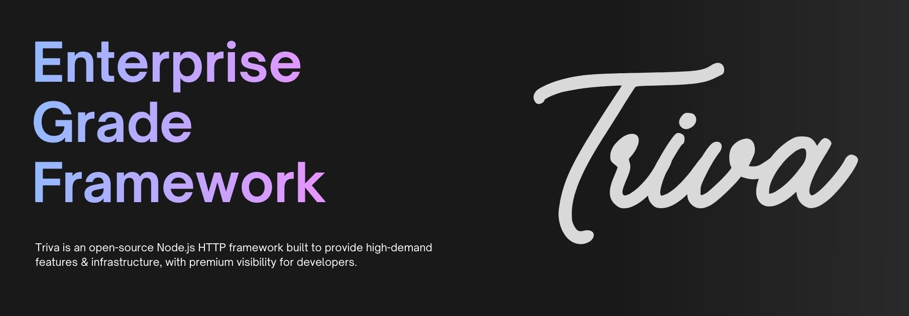

# Open Source

The `TrivaJS` organization develops and maintains open-source resources & projects for public use.

Projects hosted here include libraries, tooling, infrastructure components, and long-lived foundational systems.

Feel free to explore an [overview of our current, and archived projects.](URL)

---

## Contributions

External contributions are welcome and reviewed under a common contribution policy.

Participation implies agreement with the organization’s contribution standards and governance process.

----

Triva and the projects in association adopt the [Triva Code of Conduct](URL). For more information see the [Code of Conduct FAQ](URL).
