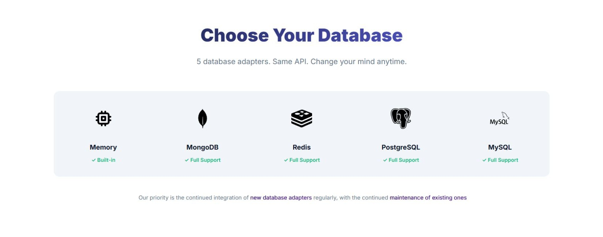

CLI - Seperate package

Commands
t build
t build memory
t build mongodb
t build redis
t build postgresql
t build mysql

t log get id
t log get all
t log filter (filters)
t logs delete id
t logs clear

README UPDATE - Migrate current readme to guide.md

  

    
  

  

    
  

  

  
  

  

  
  

  

    A Node.js HTTP Server Framework built for enterprises
  

  

    Triva is an enterprise-grade Node.js HTTP framework with centralized configuration, database adapters, advanced middleware, and complete developer visibility.
  

